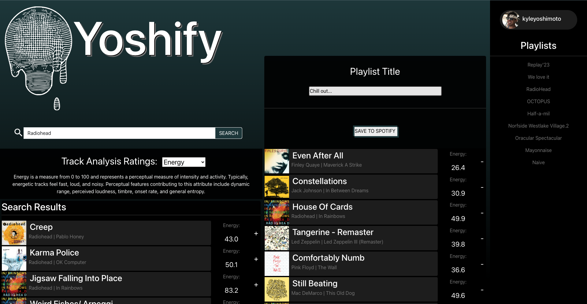

# Yoshify React Web Application
Yoshify utilizes my expertise in React components, managing state, and interfacing with the Spotify API to create a website. This platform will empower users to explore the Spotify library; view track statistics such as valence, tempo, danceability, and more; generate personalized playlists; and subsequently save them to their respective Spotify accounts.

## Overview
Yoshify is a web-based application developed using React, enabling users to perform the following actions:

- Search the extensive Spotify library for tracks, albums, or artists.
- Access track statistics such as energy, valence, tempo, and more.
- Create custom playlists by adding tracks from the search results.
- Save the personalized playlists to their Spotify accounts for future access.
- Spotify Authentication: The application allows users to authenticate and access their Spotify accounts, enabling them to save playlists directly.

## Installation
To run this project locally, follow these steps:

Clone the repository using the following command:

bash
Copy code
  git clone https://github.com/your-username/Yoshify-playlist-function.git
Navigate to the project directory:

bash
Copy code
  cd Yoshify-playlist-function
Install the required dependencies:

Copy code
  npm install
Obtain Spotify API credentials by creating an application on the Spotify Developer Dashboard.

Create a .env file in the root directory and add the following:

makefile
Copy code
  clientId=YOUR_CLIENT_ID
  redirectUri=http://localhost:3000/
***Replace YOUR_CLIENT_ID with your actual Spotify API client ID.***

## Start the application:

sql
Copy code
npm start
Access the application in your web browser at http://localhost:3000/.

## Technologies Used
React
Spotify API
JavaScript (ES6+)
HTML/CSS

### Credits
This project was created as part of a learning experience and is inspired by the Codecademy "Build Front-End Web Applications from Scratch" curriculum.

Feel free to contribute, report issues, or provide feedback. Happy Jammming! 🎶🎧

=======

# Getting Started with Create React App

This project was bootstrapped with [Create React App](https://github.com/facebook/create-react-app).

## Available Scripts

In the project directory, you can run:

### `npm start`

Runs the app in the development mode.\
Open [http://localhost:3000](http://localhost:3000) to view it in your browser.

The page will reload when you make changes.\
You may also see any lint errors in the console.

### `npm test`

Launches the test runner in the interactive watch mode.\
See the section about [running tests](https://facebook.github.io/create-react-app/docs/running-tests) for more information.

### `npm run build`

Builds the app for production to the `build` folder.\
It correctly bundles React in production mode and optimizes the build for the best performance.

The build is minified and the filenames include the hashes.\
Your app is ready to be deployed!

See the section about [deployment](https://facebook.github.io/create-react-app/docs/deployment) for more information.

### `npm run eject`

**Note: this is a one-way operation. Once you `eject`, you can't go back!**

If you aren't satisfied with the build tool and configuration choices, you can `eject` at any time. This command will remove the single build dependency from your project.

Instead, it will copy all the configuration files and the transitive dependencies (webpack, Babel, ESLint, etc) right into your project so you have full control over them. All of the commands except `eject` will still work, but they will point to the copied scripts so you can tweak them. At this point you're on your own.

You don't have to ever use `eject`. The curated feature set is suitable for small and middle deployments, and you shouldn't feel obligated to use this feature. However we understand that this tool wouldn't be useful if you couldn't customize it when you are ready for it.

## Learn More

You can learn more in the [Create React App documentation](https://facebook.github.io/create-react-app/docs/getting-started).

To learn React, check out the [React documentation](https://reactjs.org/).

### Code Splitting

This section has moved here: [https://facebook.github.io/create-react-app/docs/code-splitting](https://facebook.github.io/create-react-app/docs/code-splitting)

### Analyzing the Bundle Size

This section has moved here: [https://facebook.github.io/create-react-app/docs/analyzing-the-bundle-size](https://facebook.github.io/create-react-app/docs/analyzing-the-bundle-size)

### Making a Progressive Web App

This section has moved here: [https://facebook.github.io/create-react-app/docs/making-a-progressive-web-app](https://facebook.github.io/create-react-app/docs/making-a-progressive-web-app)

### Advanced Configuration

This section has moved here: [https://facebook.github.io/create-react-app/docs/advanced-configuration](https://facebook.github.io/create-react-app/docs/advanced-configuration)

### Deployment

This section has moved here: [https://facebook.github.io/create-react-app/docs/deployment](https://facebook.github.io/create-react-app/docs/deployment)

### `npm run build` fails to minify

This section has moved here: [https://facebook.github.io/create-react-app/docs/troubleshooting#npm-run-build-fails-to-minify](https://facebook.github.io/create-react-app/docs/troubleshooting#npm-run-build-fails-to-minify)
